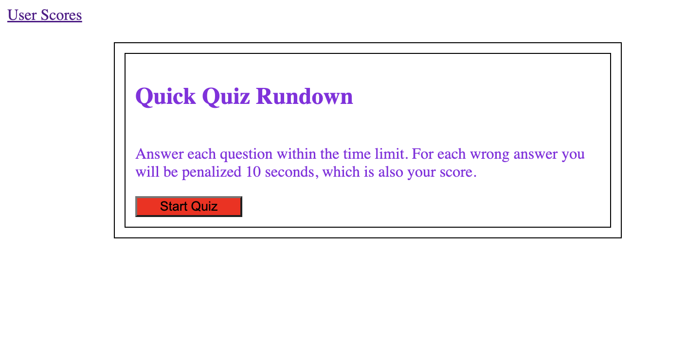
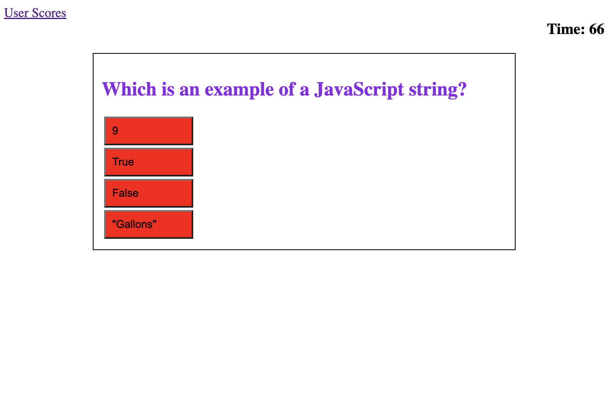
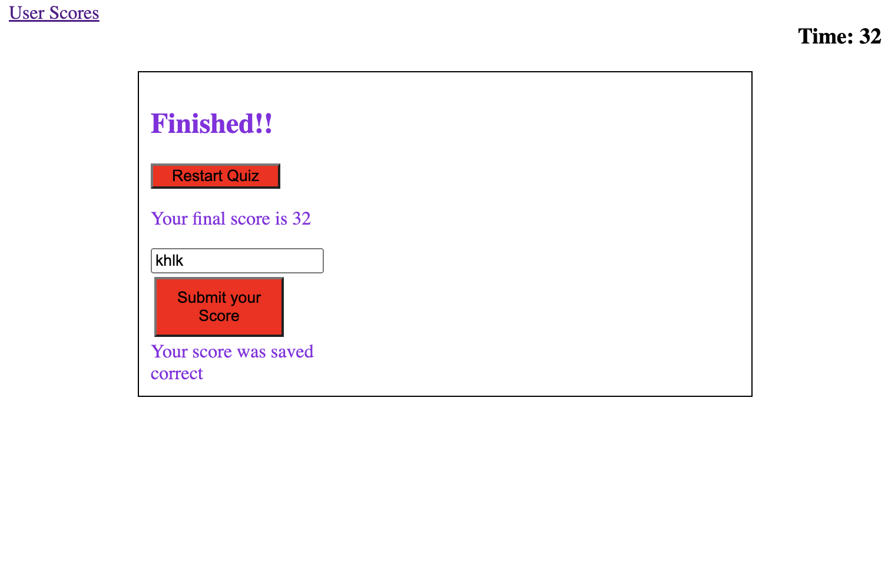

# Challenge 4 JavaScript Quiz

## Finished Quiz Summary

I was wanting to make a site that would be a test ones knowledge in various JavaScript questions.  The quiz is timed and for each wrong answer seconds were deducted from the total time so that if the time hit zero it would automatically force the quiz to the end with a score of 0.  I also wanted to make it competitive so that anyone could input there initials and it would save their initials along with their score to local storage.  This data would be pulled when they accessed the high score page.  The option is also available for to clear the high score data entry on local storage.  While making this site I learned more about data direction and how it can be used to change the what is viewed on the webpage.  Additionally I learned how a parent element could listen for a “click” in a child element to cause a change on the page.

The following is a link to the website [Java Script quiz site] (https://arms-like-trees.github.io/Challenge-4/)

## Finished product appearances

The following shows the site in various aspects of the quiz experience as well as the high score page.

